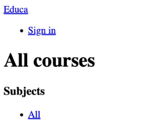
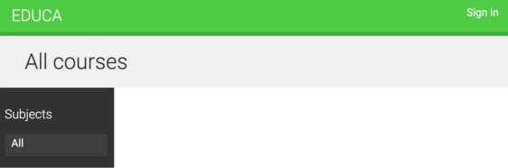

Going live in production with a Django web application involves several steps to ensure that your application is secure, performant, and stable. Here's a high-level overview of the process:

# 01. Creating a production environment
It’s time to deploy your Django project in a production environment. You are going to follow these steps to get your project live:
- Configure project settings for a production environment
- Use a PostgreSQL database
- Set up a web server with uWSGI and NGINX
- Serve static assets through NGINX
- Secure connections using SSL
- Use Daphne to serve Django Channels

# 02. Managing settings for multiple environments
In real-world projects, you will have to deal with multiple environments. You will have at least a local and  a production environment, but you could have other environments as well, such as testing or preproduction environments. Some project settings will be common to all environments, but others will have to be overriden per environment. Let's set up project settings for multiple environments, while keeping everything neatly organized.

Create a ***settings/*** directory next to the ***settings.py*** file of the ***educa*** project. Rename the ***settings.py*** file to ***base.py*** and move it into the new ***settings/*** directory. Create the following additional files inside the ***settings/*** folder so that the new directory books as follows:
```
settings/
    __init__.py
    base.py
    local.py
    pro.py
```
These files are as follows:
- `base.py`: The base settings file that contains common settings (previously `settings.py`)
- `local.py`: Custom settings for your local environment
- `pro.py`: Custom settings for the production environment

Edit the `settings/base.py` file and replace the following line:
```python
from pathlib import Path
BASE_DIR = Path(__file__).resolve().parent.parent
```
or
```python
import os
BASE_DIR = os.path.dirname(os.path.dirname(os.path.abspath(__file__)))
```
with the following one:
```python
import os
BASE_DIR = os.path.dirname(os.path.dirname(os.path.abspath(os.path.join(__file__,os.pardir))))
```
You have moved your settings files to a directory one level lower, so you need `BASE_DIR` to point to the parent directory to be correct. You achieve this by pointing to parent directory with `os.pardir`.
Edit the `settings/local.py` file and add following lines of code:
```python
import os
from .base import *
DEBUG = True
DATABASES = {
    'default': {
        'ENGINE': 'django.db.backends.sqlite3',
        'NAME': os.path.join(BASE_DIR, 'db.sqlite3')
    }
}
```
This is the settings file for your local environment. You import all settings defined in the `base.py` file and you only define specific settings for this environment. You copy the `DEBUG` and `DATABASES` settings from the `base.py` file, since these will be set per environment. You can remove the `DATABASES` and `DEBUG` settings from the `base.py` settings file.
Edit the `settings/pro.py` file and make it look as follows:
```python
import os
from .base import *
DEBUG = False
ADMINS = (
    ('root', 'root@example.com')
)
ALLOWED_HOSTS = ['*']
DATABASES = {
    'default': {
    }
}
```
These are the settings for the production environment. Let's take a closer look at each of them:
- `DEBUG`: Setting `DEBUG` to `False` should be mandatory for any production environment. Failing to do so will result in the traceback information and sensitive configuration data being exposed to everyone.
- `ADMINS`: When `DEBUG` is `False` and a view raises an exception, all information will be sent by email to the people listed in the `ADMINS` setting. Make sure that you replace the name/email tuple with your own information.
- `ALLOWED_HOSTS`:` Django will only allow the hosts included in this list to serve the application. This is a security measure. You include the asterisk symbol, *, to refer to all hostnames that can be used for serving the application later.
- `DATABASES`: You just keep this setting empty. We are going to cover the database setup for production later.

When handling multiple environments, create a base settings file and a settings file for each environment. Environment settings files should inherit the common settings and override environment-specific settings.

You have placed the project settings in a different location than the default `settings.py` file. You will not be able to execute any commands with the `manage.py` tool unless you specify the settings module to use. You will need to add a `--settings` flag when you run management commands from the shell or set a `DJANGO_SETTINGS_MODULE` environment variable.

Open the shell and run the following command:
```python
export DJANGO_SETTINGS_MODULE=educa.settings.pro
```

This will set the `DJANGO_SETTINGS_MODULE` environment variable for the current shell session. If you want to avoid executing this command for each new shell, add this command to your shell's configuration in the `.bashrc` or `.bash_profile` files. If you don't set this variable, you will have to run management commands, including the `--settings` flag, as follows:
```python
python manage.py shell --settings=educa.settings.pro
```

You have successfully organized settings for handling multiple environments.

# 03. Using PostgreSQL

Throughout this book, you have mostly used the SQLite database. SQLite is simple and quick to set up, but for a production environment, you will need a more powerful database, such as PostgreSQL, MySQL or Oracle. You already learned how to install PostgreSQL and set up a PostgreSQL database, Extending Your Blog Application. If you need to install PostgreSQL, you can read the Installing PostgreSQL section.

Let's create a PostgreSQL user. Open the shell and run the following commands to create a database user:
```shell
su postgres
createuser -dP educa
```
You will be prompted for a password and the permissions that you want to give to this user. Enter the desired password and permissions, and then create a new database with the following command:
```shell
createdb -E utf8 -U educa educadb
```
Then, edit the `settings/pro.py` file and modify the `DATABASES` setting to make it look as follows:
```python
DATABASES = {
    'default': {
        'ENGINE': 'django.db.backends.postgresql',
        'NAME': 'educa',
        'USER': 'educa',
        'PASSWORD': '*********'
    }
}
```
Replace the preceding data with the database name and credentials for the user you created. The new database is empty. Run the following command to apply all database migrations:
```python
python manage.py migrate
```
Finally, create a superuser with the following command:
```python
python manage.py createsuperuser
```
# Checking your project
Django includes the `check` management command for checking your project at any time. This command inspects the applications installed in your Django project and outputs any errors or warnings. If you include the `--deploy` option, additional checks only relevant for production use will be triggered. Open the shell and run the following command to perform a check:
```shell
python manage.py check --deploy
```
You will see output with no errors, but several warnings. This means the check was successful, but you should go through the warnings to see if there is anything more you can do to make your project safe for production. We are not going to go deeper into this, but keep in mind that you should check your project before production use to look for any relevant issues.

# Serving Django through WSGI
Django's primary deployment platform is WSGI. `WSGI` stands for ***Web Server Gateway Interface*** and it is the standard for serving Python applications on the web.

When you generate a new project using the `startproject` command, Django creates a `wsgi.py` file inside your project directory. This file contains a WSGI application callable, which is an access point to your application.

WSGI is used for both running your project with the Django development server and deploying your application with the server of your choice in a production environment.

You can learn more about WSGI at [`link`](https://wsgi.readthedocs.io/en/latest/)

# Installing uWSGI
The Django development server to tun projects in your local environment. However, you need a real web server for deploying your application in a production environment.

uWSGI is an extremely fast Python application server. It communicates with your Python application using the WSGI specification. uWSGI translates web requests into a format that your Django project can process.

Install uWSGI using the following command:
```shell
pip install uwsgi==2.0.23
```
In order to build uWSGI, you will need a C compiler, such as `gcc` or `clang`. In a Linux environment, you can install a C compiler with command `apt-get install build-essential`.

If you are using macOS, you can install uWSGI with the Homebrew package manager using the command `brew install uwsgi`.

If you want to install uWSGI on Windows, you will need [Cygwin](https://www.cygwin.com/). However, it's desirable to use uWSGI in UNIX-based environments.

You can read uWSGI's documentation at [homepage](https://uwsgi-docs.readthedocs.io/en/latest/)

# Configuring uWSGI
You can run uWSGI from the command line. Open the shell and run the following command from the `educa` project directory:
```shell
sudo uwsgi --module=educa.wsgi:application \
--env=DJANGO_SETTINGS_MODULE=educa.settings.pro \
--master --pipfile=/tmp/project-master.pid \
--http=127.0.0.1:8000 \
--uid=1000 \
--virtualenv=/home/env/educa
```
Replace the path in the `virtualenv` option with your actual virtual environment directory. If you are not using a virtual environment, you can skip this option.

You might have to prepend `sudo` to this command if you don't have the required permissions. You might also need to add the `--plugin=python3` option if the module is not loaded by default.

With this command, you can run uWSGI on your localhost with the following options:
- You use the `educa.wsgi:application` WSGI callable
- You load the settings for the production environment
- You tell uWSGI to use the `educa` virtual environment

If you are not running the command within the project directory, include the option `--chdir=/path/to/educa/` with the path to your project.

Open `http://127.0.0.1:8000/` in your browser. You should see a screen like the following one:



You can see the rendered HTMl that corresponds to course list view, but no CSS style sheets or images are being loaded. The reason for this is that you didn't configure uWSGI to serve static files. You will configure serving static files in the production environment later.

uWSGI allows you to define a custom configuration in a `.ini` file. This is more convenient than passing options through the command line.

Create the following file structures inside the global `edica/` directory:
```
config/
    uwsgi.ini
logs/
```
Edit the `config/uwsgi.ini` file and add the following code to it:
```
[uwsgi]
# variables
projectname = educa
base = /home/projects/educa
# configuration
master = true
virtualenv = /home/env/%(projectname)
pythonpath = %(base)
chdir = %(base)
env = DJANGO_SETTINGS_MODULE=%(projectname).settings.pro
module = %(projectname).wsgi:application
socket = /tmp/%(projectname).sock
chmod-socket = 666
```
In the `uwsgi.ini` file, you define the following variables:
- `projectname`: The name of your Django project, which is `educa`.
- `base`: The absolute path to the `educa` project. Replace it with the absolute path to your project.

These are custom variables that you will use in the uWSGI options. You can define any other variables you like as long as the names are different to the uWSGI options.

You set the following options:
- `master`: Enable the master process.
- `virtualenv`: The path to your virtual environment. Replace this path with the appropriate path.
- `pythonpath`: The paths to add to your Python path.
- `chdir`: The path to your project directory, so that uWSGI changes to that directory before loading the application.
- `env`: Environment variables. You include the `DJANGO_SETTINGS_MODULE`variable, pointing to the settings for the production environment.
- `module`: The WSGI module to use. You set this to the `application` callable contained in the `wsgi` module of your project.
- `socket`: The UNIX/TCP socket to bind the server.
- `chmod-socket`: The file permissions to apply to the socket file. In this case, you use `666` so that NGINX can read/write the socket.

The `socket` option is intended for communication with some third-party router, such as NGINX, while the `http` option is for uWSGI to accept incoming HTTP requests and route them by itself. You are going to run uWSGI using a socket, since you are going to configure NGINX as your web server and communicate with uWSGI through the socket.

You can find the list of available uWSGI options at [Options](https://uwsgi-docs.readthedocs.io/en/latest/Options.html).
```shell
uwsgi --ini config/uwsgi.ini
```
You will not be able to access your uWSGI instance from your browser now, since it's running through a socket. Let's complete the production environment.

# Installing NGINX
When you are serving a website, you have to serve dynamic content, but you also need to serve static files, such as CSS style sheets, JavaScript files, and images. While uWSGI it capable of serving static files, it adds an unnecessary overhead to HTTP requests and therefore, it is encouraged to set up a web server, such as NGINX, in front of it.

NGINX is a web server focused on high concurrency, performance, and low memory usage. NGINX also acts as a reverse proxy, receiving HTTP requests and routing them to different backends. As mentioned, generally, you will use a web server, such as NGINX, in front of uWSGI for serving static files efficiently and quickly, and you will forward dynamics requests to uWSGI workers. By using NGINX, you can also apply rules and benefit from its reverse proxy capabilities.

Install NGINX with the following command:
```shell
sudo apt-get install nginx
```
If you are using macOS, you can install NGINX using the command `brew install nginx`.
You can find NGINX binaries for Windows at [NGINX](https://nginx.org/en/download.html).

Open a shell and run NGINX with the following command:
```shell
sudo nginx
```
Open the URL `http://127.0.0.1` in your browser. You should see the following screen:


If you see this screen, NGINX is successfully installed. `80` is the port for the default NGINX configuration.

# The production environment
The following diagram shows the request/response cycle of the production environment that you are setting up:


The following will happen when the client browser sends an HTTP request:
1. NGINX receives the HTTP request
2. NGINX delegates the request to uWSGI through a socket
3. uWSGI passes the request to Django for processing
4. Django returns an HTTP response that is passed back to NGINX, which in turn passes it back to the client browser

# Configuring NGINX
Create a new file inside the `config/` directory and name it `nginx.conf`. Add the following code to it:
```
# the upstream component nginx needs to connect to
upstream educa {
    server      unix:///tmp/educa.sock;
}
server {
    listen       80;
    server_name  www.educaproject.com educaproject.com;
    access_log   off;
    error_log    /home/projects/educa/logs/nginx_error.log;
    location / {
        include      /etc/nginx/uwsgi_params;
        uwsgi_pass   educa;
    }
}
```

This is the basic configuration for NGINX. You set up an upstream named `educa`, which points to the socket created by uWSGI. You use the `server` block and add the following configuration:
- You tell NGINX to listen on port `80`.
- You set the server name to both `www.educaproject.com` and `educaproject.com`. NGINX will serve incoming requests for both domains.
- You explicitly set `access_log` to `off`. You can use this directive to store access logs in a file.
- You use the `error_log` directive to set the path to the file where you will be storing error logs. Replace this path with the path where you would like to store NGINX error logs. Analyze this log file if you run into any issue while using NGINX.
- You include the default uWSGI configuration parameters that come with NGINX. These are located next to the default configuration file for NGINX. You can usually find them in any of these three locations: `/usr/local/nginx/conf/usgi_params`,`/etc/nginx/usgi_params`, or `/usr/local/etc/nginx/usgi_params`.
- You specify that everything under the `/` path has to be routed to the `educa` socket (uWSGI).

You can find the NGINX documentation at [docs](https://nginx.org/en/docs/).

The default configuration file for NGINX is named `nginx.conf` and it usually resides in any of these three directories: `/usr/local/nginx/conf`, `/etc/nginx`, or `/usr/local/etc/nginx`.

Locate your `nginx.conf` configuration file and ad the following `include` directive inside the `http` block:
```shell
    http {
      include /home/project/educa/config/nginx.conf;
      # ...
    }
```
Replace `/home/projects/educa/config/nginx.conf` with the path to the configuration file you created for the `educa` project. In this code, you include the NGINX configuration file for your project in the default NGINX configuration.

Open a shell and run uWSGI if you are not running it yet:

```shell
uwsgi --ini config/uwsgi.ini
```
Open a second shell and reload NGINX with the following command:
```shell
sudo nginx -s reload
```
Whenever you want to stop NGINX, you can gracefully do so with the following command:
```shell
sudo nginx -s quit
```
If you want to quickly stop NGINX instead of `quit` use the signal `stop`. The `quit` signal waits for worker processes to finish serving current requests, while the `stop` signal stops NGINX abruptly.

Since you are using a sample domain name, you need to redirect it to your local host. Edit your `/etc/hosts` file and add the following line to it:
```shell
127.0.0.1 educaproject.com www.educaproject.com
```
By doing so, you are routing both hostnames to your local server. In a production server, you won't need to do this, since you will have a fixed IP address, and you will point your hostname to your server in your domain's DNS configuration.

Open `http://educaproject.com/` in your browser. You should be able to see your site, still without any static assets loaded. Your production environment is almost ready.

Now you can restrict the hosts that can serve your Django project. Edit the production settings file `settings/pro.py` of your project and change the `ALLOWED_HOSTS` settings, as follows:
```
ALLOWED_HOSTS=['educaproject.com', 'www.educaproject.com']
```

Django will now only serve your application if it's running under any of these hostnames. You can read more about the `ALLOWED_HOSTS` settings at [ALLOWED_HOST](https://docs.djangoproject.com/en/4.2/ref/settings/#allowed-hosts)

# Serving static and media assets
uWSGI is capable of serving static files flawlessly, but it is not as fast and effective as NGINX. For the best performance, you will use NGINX to serve the static files in your production environment. You will set up NGINX to serve both the static files of your application (CSS style sheets, JavaScript files and images) and media files uploaded by instructors for the course contents.

Edit the `settings/base.py` file and add the following line just below the `STATIC_URL` settings:
```shell
STATIC_ROOT = os.path.join(BASE_DIR, 'static')
```
Each application in your Django project may contain static files in a `static/` directory. Django provides a command to collect static files from all applications into a single location. This simplifies the setup for serving static files in production.

The `collectstatic` command collects the static files from all applications of the project into the path defined in `STATIC_ROOT`.

Open the shell and run the following command:
```shell
python manage.py collectstatic
```
You will see this output:
```shell
165 static files copied to '/educa/static'
```
Files located under the `static/` directory of each application present in the `INSTALLED_APPS` setting have been copied to the global `/educa/static/` project directory.

Now, edit the `config/nginx.conf` file and change its code, like this:
```shell
# the upstream component nginx needs to connect to
upstream educa {
    server      unix:///tmp/educa.sock;
}
server {
    listen       80;
    server_name  www.educaproject.com educaproject.com;
    access_log   off;
    error_log    /home/projects/educa/logs/nginx_error.log;
    location / {
        include      /etc/nginx/uwsgi_params;
        uwsgi_pass   educa;
    }
    location /static/ {
        alias /home/projects/educa/static/;
    }
    location /media/ {
        alias /home/projects/educa/media/;
    }
}
```
Remember to replace the `/home/projects/educa/` path with the absolute path to your project directory. These directives tell NGINX to serve static files located under the `/static/` and `/meida/` path directly. These paths are as follows:
- `/static/`: Corresponds to the path of the `STATIC_URL` setting. The target path corresponds to the value of the `STATIC_ROOT` setting. You use it to serve the static files of your application.
- `/media/`: Corresponds to the path of the `MEDIA_URL` setting, and its target path corresponds to the value of the `MEDIA_ROOT` setting. You use it to serve the media files uploaded to the course contents.

The schema of the production environment now looks like this:


Files under the `/static/` and `/media/` paths are now served by NGINX directly, instead of being forwarded to uWSGI. Requests to any other paths are still passed by NGINX to uWSGI through the UNIX socket.

Reload NGINX's configuration with the following command to keep track of the new paths:
```shell
sudo nginx -s reload
```
Open `http://educaproject.com/` in your browser. You should see the following screen:


Static resources, such as CSS style sheets and images, are now loaded correctly. HTTP requests for static files are now being served by NGINX directly, instead of being forwarded to uWSGI.

Great! You have successfully configured NGINX for serving static files.

# Securing connection with SSL/TLS
The ***Transport Layer Security (TLS)*** protocol is the standard for serving websites through a secure connection. The TLS predecessor is ***Secure Sockets Layer (SSL)***. Although SSL is now deprecated, in multiple libraries and online documentation you will find references to both the terms TLS and SSL. It's strongly encouraged that you serve your websites under HTTPS. You are going to configure an SSL/TLS certificates in NGINX to serve your site securely.

# Creating an SSL/TLS certificate
Create a new directory inside the `educa` project directory and name it `ssl`. Then, generate an SSL/TLS certificate from the command line with the following command:
```shell
sudo openssl req -x509 -nodes -days 365 -newkey rsa:2048 -keyout ssl/educa.key -out ssl/educa.crt
```
You are generating a private key and a 2048-bit SSL/TLS certificate that is valid for one year. You will be asked to enter data, as follows:
```shell
Country Name (2 letter code) []:
State or Province Name (full name) []:
Locality Name (eg, city) []:
Organization Name (eg, company) []:
Organizational Unit Name (eg, section) []:
Common Name (eg, fully qualified host name) []: educaproject.com
Email Address []: email@domain.com
```
You can fill in the requested data with your own information. The most important field is the `Common Name`. You have to specify the domain name for the certificate. You use `educaproject.com`. This will generate, inside the `ssl/` directory, an `educa.key` private key file and an `educa.crt` file, which is the actual certificate.
